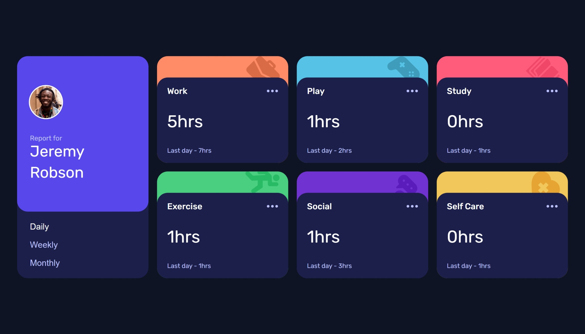
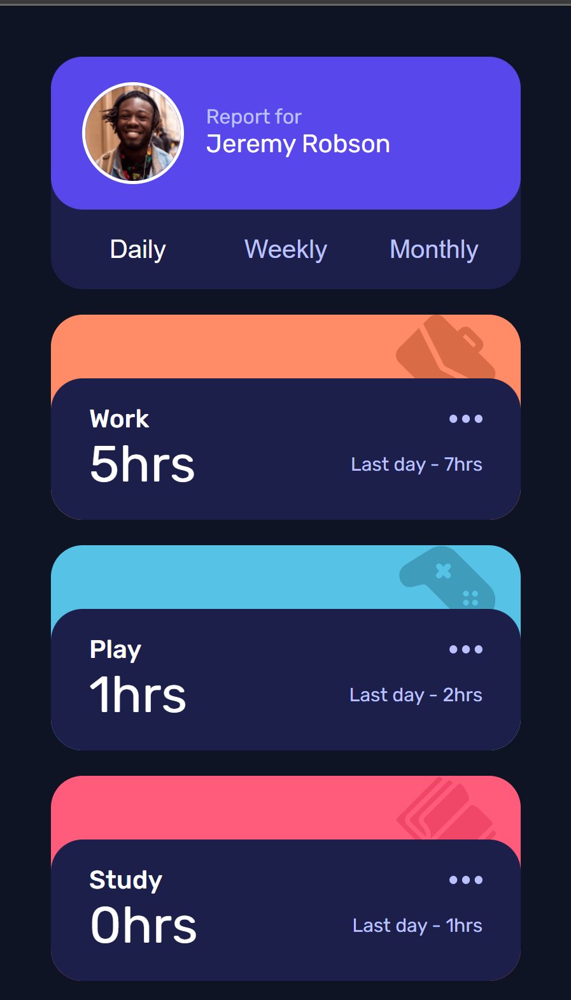
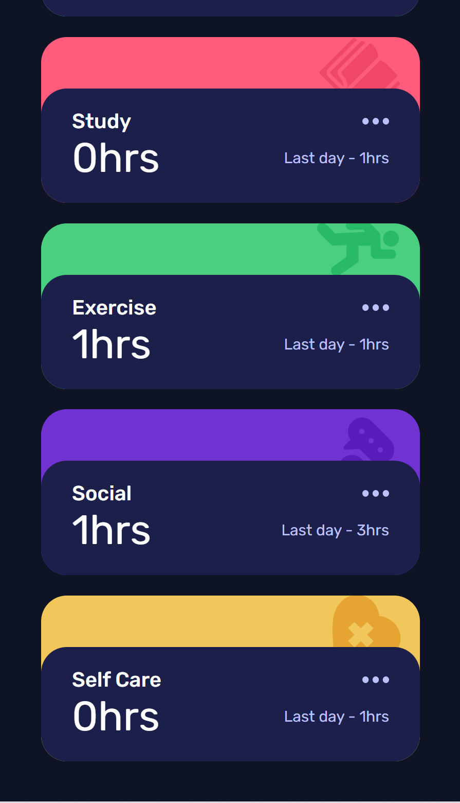

# Frontend Mentor - Time tracking dashboard solution

This is a solution to the [Time tracking dashboard challenge on Frontend Mentor](https://www.frontendmentor.io/challenges/time-tracking-dashboard-UIQ7167Jw). Frontend Mentor challenges help you improve your coding skills by building realistic projects. 

## Overview
Any feedback will be welcome :D
I make this with microsoft Surface Pro 7.

### The challenge

Users should be able to:

- View the optimal layout for the site depending on their device's screen size
- See hover states for all interactive elements on the page
- Switch between viewing Daily, Weekly, and Monthly stats

### Screenshot

### Links

- Solution URL: [Add solution URL here](https://your-solution-url.com)
- Live Site URL: [Add live site URL here](https://your-live-site-url.com)

## My process
1. install react by create-react-app
2. design in Figma for praticing 
3. filter data
4. css with styled-components

### Built with

- Semantic HTML5 markup
- Flexbox
- CSS Grid
- Mobile-first workflow
- [React](https://reactjs.org/) - JS library
- [Styled Components](https://styled-components.com/) - For styles

### Useful resources

- [Airbnb JavaScript Style Guide](https://airbnb.io/javascript/react/#class-vs-reactcreateclass-vs-stateless) - learn how to style in good way
- [use CSS Media Query Breakpoint in Styled-Components](https://dev.to/cagatayunal/how-to-use-css-media-query-breakpoint-in-styled-components-9of) - helped me realize how to make RWD with styled-components
- [expected a string (for built-in components) or a class/function](https://github.com/facebook/react/issues/13445) - I export obj that included React component,it becomes React element when it imported.I find this and resolve my problem.

## Author

- Website - [Rosa Hong](https://blog.rosa.tw/)
- Frontend Mentor - [@Rosa Hong](https://www.frontendmentor.io/profile/meitung473)

